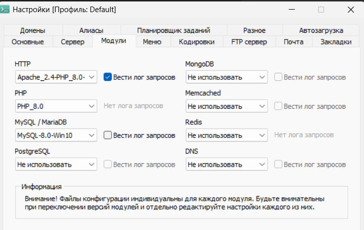
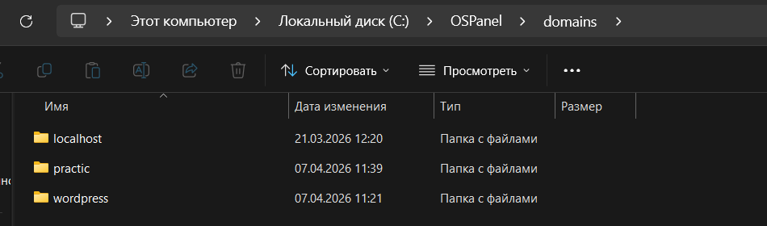
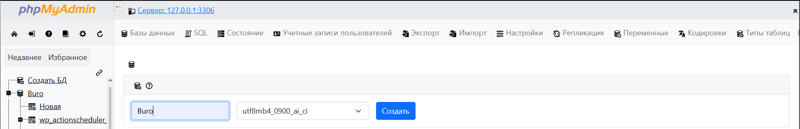

- Инструменты:
OSPanel v5.4.3.0

- Запуск:
размесить и распоковать файл domains
Запустить OSPanel
Зайти Дополнительно - PhPMyAdmin (имя пользователя root, пароль пусто)
Создать таблицу Buro  имотртировать файл Buro.sql
Зайти Мои проекты выбрать выбрать папку с проектом